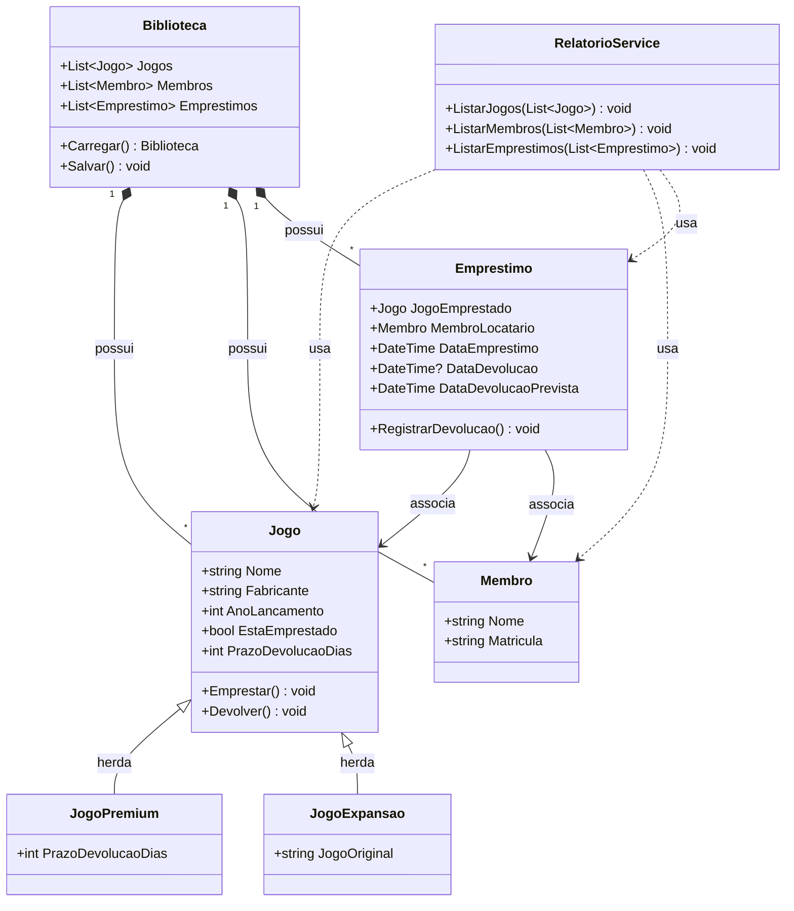

# Projeto "Ludoteca .NET" (AV2)

## 📖 Descrição do Projeto

Este é um aplicativo de console desenvolvido em C# para o controle de empréstimo de jogos de tabuleiro de um clube universitário. O sistema permite cadastrar jogos e membros, registrar empréstimos e devoluções, e persistir todos os dados em um arquivo JSON.

Este projeto corresponde à entrega da **AV2**, construída sobre a base da AV1, focando agora em **Orientação a Objetos Avançada** (Herança, Polimorfismo e Arquitetura).

## 👥 Integrantes

| Nome | Matrícula |
| :--- | :--- |
| Lucas Gabriel Simões Marinho | 06009936 |
| Julia Scarpi Campos | 06006846 |
| Flora Martins Di Risio Pinheiro | 06010591 |
| Emanuel De Oliveira Freitas Branco | 06010524 |
| Carlos Eduardo Mendes Quintella | 06011992|
| Arthur Martins | 06012635 |


## 🛠️ Funcionalidades do Sistema

### ✅ Funcionalidades Básicas (AV1)
O núcleo do sistema, desenvolvido na primeira etapa, inclui:

* **Cadastro de Jogos:** Adição de novos jogos ao acervo.
* **Cadastro de Membros:** Registro de alunos aptos a pegar jogos.
* **Listagem Geral:** Exibição de todos os jogos e membros cadastrados.
* **Controle de Empréstimos:** Associação de um jogo a um membro, com bloqueio de jogos já emprestados.
* **Devolução:** Liberação do jogo para novos empréstimos.
* **Persistência de Dados:** Salva e carrega automaticamente os dados no arquivo `biblioteca.json` (serialização).
* **Tratamento de Exceções:** Uso de `try/catch` para impedir que o programa feche com erros de digitação.

### 🚀 Novas Funcionalidades e Melhorias (AV2)
Nesta etapa final, o código foi refatorado e expandido para incluir:

* **Herança de Classes:**
    * Implementação de **`JogoPremium`** e **`JogoExpansao`** que herdam da classe base `Jogo`.
    * Permite tratar diferentes tipos de jogos na mesma lista.
* **Polimorfismo (Regra de Negócio Dinâmica):**
    * Cálculo automático da data de devolução baseado no tipo do objeto:
    * *Jogos Comuns/Expansões:* Prazo padrão de **7 dias**.
    * *Jogos Premium:* Prazo reduzido de **3 dias** (sobrescrita de método/propriedade).
    * O código elimina condicionais complexas (`if/else`) delegando a responsabilidade para a própria classe.
* **Refatoração com Services:**
    * Criação da classe **`RelatorioService`**.
    * Responsável por toda a lógica de exibição (Interface), limpando o código do `Program.cs`.
* **Relatório de Prazos:**
    * Nova opção no menu para listar empréstimos ativos mostrando a "Data de Devolução Prevista" calculada via polimorfismo.

## 🚀 Como Executar o Projeto

Para compilar e executar a aplicação, utilize os seguintes comandos no terminal, a partir da pasta raiz do projeto:

```bash
# Para construir o projeto
dotnet build

# Para executar o projeto
dotnet run
```

## 📋 Artefatos e Marcações da AV2

### 1. Diagrama UML

___


### 2. Vídeo de Apresentação

O vídeo de demonstração do sistema está disponível no link:
https://youtu.be/ITCGn71gzx4?si=JwjlwcKySYODXoya


### 🔍 Guia de Correção e Marcações

Critério|Descrição|Arquivo|Onde Encontrar
| :--- | :--- | :--- | :--- |
[AV2-1]|Modelagem e Service|RelatorioService.cs|Classe completa
[AV2-2]|Herança (Premium)|JogoPremium.cs|Definição da classe
[AV2-2]|Herança (Expansão)|JogoExpansao.cs|Definição da classe
[AV2-4]|Polimorfismo (Base)|Jogo.cs|Propriedade virtual
[AV2-4]|Polimorfismo (Override)|JogoPremium.cs|Propriedade override
[AV2-4]|Polimorfismo (Uso)|Emprestimo.cs|Construtor (Cálculo de data)
